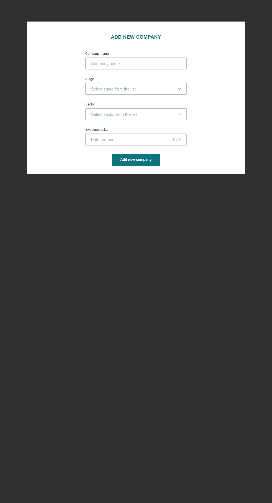

# VESTBERRY Test Assignment

## TASK

Your task is to create a simple page with a table of companies and a chart indicating size of investments, based on the design created in photoshop.

Start with prepared project we have created with our backend

 

## OBJECTIVES

* Try to get the template visual as close as possible to the design created in PSD

* Make it possible to add new company to the table (with its name, stage, sector and investment size)

* Adding new company, should also be reflected in the „companies by investment size pie chart“, and „companies by sectors statistics“

* Adding new company should be done using a simple modal box (design included in PSD)

* Feel free to use any additional library you might need for completing this project, or change structure or anything

* We would like to see, how will you solve this task in terms of end result precision, code quality & readability

## PROJECT STRUCTURE

```
.
├── Assets                   # Assets and teplates for this project
├── public                   # Static public assets (not imported anywhere in source code)
├── server                   # Express application that provides graphql backend
│   └── main.js              # Server application entry point
├── src                      # Application source code
```

## Requirements
* node `^12.0.0`
* yarn `^1.9.2` or npm `^6.2.0`

## Installation

After confirming that your environment meets the above [requirements](#requirements), clone `vestberry` by doing the following:

```bash
$ git clone git@github.com:VESTBERRY/Test-assignment.git <directory>
$ cd <directory>
```

When that's done, install the project dependencies. It is recommended that you use [Yarn](https://yarnpkg.com/) for deterministic dependency management, but `npm install` will suffice.

```bash
$ yarn  # Install project dependencies (or `npm install`)
```

## Running the Project

After completing the [installation](#installation) step, you're ready to start the project!

```bash
$ yarn start  # Start the development server (or `npm start`)
```

While developing, you will probably rely mostly on `yarn start`; however, there are additional scripts at your disposal:

|`yarn <script>`        |Description|
|-----------------------|-----------|
|`start`                |Serves your app at `localhost:3000`|
|`dev-client`           |Starts the frontend part|
|`dev-server`           |Starts the backend part|
|`lint`                 |[Lints](http://stackoverflow.com/questions/8503559/what-is-linting) the project for potential errors|
|`lint:fix`             |Lints the project and [fixes all correctable errors](http://eslint.org/docs/user-guide/command-line-interface.html#fix)|
